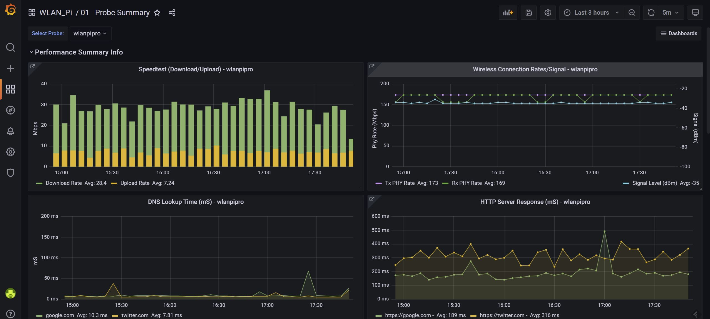

Title: About
Authors: Nigel Bowden

# About

Wiperf is a utility that is included as part of the WLAN Pi software distrubution. When switched to Wiperf mode, the WLAN Pi acts as a network probe running a series of  network tests. These tests are intended to provide an indication of the end-user experience on a wireless-connected network, but may also be used to perform  network assessment as an ethernet-connected probe.

The probe can run the following tests to give an indication of the performance of the network environment into which it has been deployed:

- Wireless connection health check (if wireless connected)
- Speedtest (Ookla/Librespeed)
- iperf3 (TCP & UDP tests)
- ICMP ping
- HTTP
- DNS
- DHCP
- SMB

Tests may be performed over the wireless or ethernet interface of the probe unit. The results must then be sent back to a InfluxDB/Grafana data colection server to provide a reporting capability. The data collection server may be a dedicated, remote server to receive data from multiple probes, or may be installed on the WLAN Pi itself to report on that single instance. 

Wiperf has been primarily designed to be a tactical tool for engineers to deploy on to a wireless network where perhaps issues are being experienced and some longer term monitoring may be required. It is not designed to replace large-scale commercial offerings that provide wireless and end-user experience monitoring in a far more comprehensive and user-friendly fashion.
