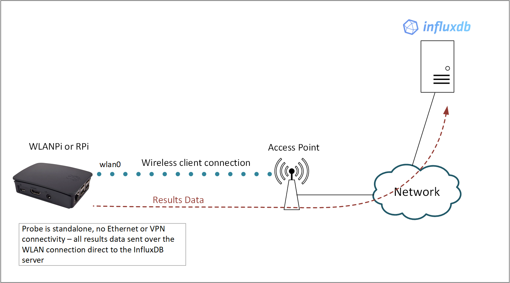
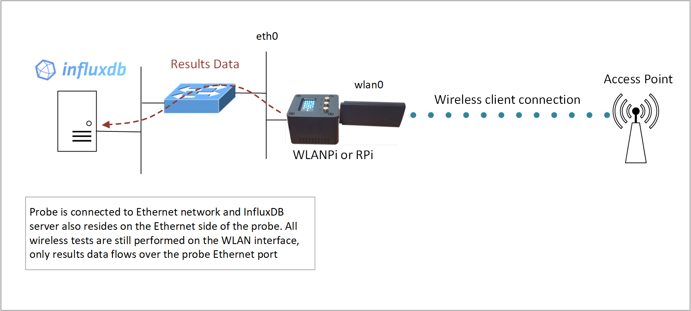
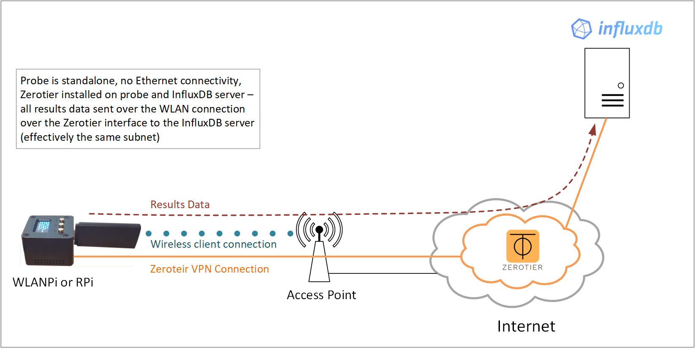

Title: InfluxDB Platform
Authors: Nigel Bowden

# InfluxDB Platform
<div style="float: right;"></div>InfluxDB is a time-series database that is used to store the network performance data that is collected by wiperf probes. It has many other uses and is used by many organizations as a back-end store for use-cases involving large amounts of timestamped data, including DevOps monitoring, application metrics, IoT sensor data, and real-time analytics.

InfluxDB does not report on network performance report data, but is used as a data repository source for Grafana in our use-case. Details about Grafana are provide later in this documentation. Note that for our use-case, we are using InfluxDB v1.8 (not v2.0).

Influx can be installed on a wide variety of Linux-based platforms that can be viewed [here](https://docs.influxdata.com/influxdb/v1.8/introduction/install/){target=_blank}. These include Ubuntu, Debian and macOS (no Windows)

This guide does not cover all installation details of the software package, as these may be obtained when downloading and installing the software.

To install InfluxDB and use it with a handful of probes, a modest server may be built (e.g. I use a low-end Intel NUC running Ubuntu), so for testing purposes, don’t get too hung up on sourcing a high-end server. If you'd like to look into server requirements further, then [check out this page](https://docs.influxdata.com/influxdb/v1.8/guides/hardware_sizing/){target=_blank}.

Note that InfluxDB is an open-source product. There is no cost for downloading and installing your own instance of the software.

## Connectivity Planning
One area to consider is connectivity between the wiperf probe and the InfluxDB instance. The wiperf probe needs to be able to access the InfluxDB server to send its results data. If the wiperf probe probe is being deployed on a network, how is the performance data generated by the probe going to get back to the InfluxDB server?

If the probe is being deployed on a customer network to perform temporary monitoring, it will need to join the wireless network under test (or be plugged in to an ethernet switch port if testing a wired connection). But how is the wiperf probe going to send its data to the InfluxDB server ? Many environments may not be comfortable with hooking up the wiperf probe to their wired network, potentially bridging wired and wireless networks. In some instances an alternative is required (e.g. send the results data over the wireless network itself out to the Internet to a cloud instance or via a VPN solution such as Zerotier.)

Three topology deployment options are supported:

- Results data over wireless
- Results data over Ethernet
- Results data over VPN/wireless 

The method used is configured on the wiperf probe probe in its config.ini file. It is important to understand the (viable) connectivity path prior to deploying both the probe and the InfluxDB server.

The 3 connectivity options are discussed below.

### Results Data Over Wireless



In this topology the wiperf probe is configured to join an SSID that has the InfluxDB server accessible via its WLAN interface. Typically, the InfluxDB server will reside in a cloud or perhaps on a publicly accessible VPS. The wiperf probe will continually run the performance tests over the wireless connection and then upload the results directly to the InfluxDB server over the WLAN connection.

!!! note "config.ini settings:"
    ```
        mgt_if: wlan0
        data_host: <public IP address of InfluxDB server> 
    ```

### Results data over Ethernet



If the InfluxDB server is being run on the inside of a network environment, it may be preferable to return results data via the Ethernet port of the wiperf probe. This topology also has the advantage of  results data not being impacted if there are wireless connectivity issues on the wiperf probe WLAN connection. To achieve the correct traffic flow, a static route for management traffic is automatically injected into the route table of the wiperf probe to force results data over the Ethernet port. 

!!! note "config.ini settings:"
    ```
        mgt_if: eth0
        data_host: <IP address of InfluxDB server> 
    ```


### Results data over Zerotier/wireless 



A simple way of getting the wiperf probe talking with your Splunk server, if it has no direct access, is to use the [Zerotier](https://zerotier.com/) service to create a virtual overlay network via the Internet. 

In summary, both the InfluxDB server and wiperf probe have the [Zerotier](https://zerotier.com/){target=_blank} client installed. Both are then added to your Zerotier dashboard (by you) and they start talking! Under the hood, both devices have a new virtual network interface created and they connect to the [Zerotier](https://zerotier.com/){target=_blank} cloud-based network service so that they can communicate on the same virtual network in the cloud. As they are on the same subnet from a networking perspective, there are no routing issues to worry about to get results data from the wiperf probe to the InfluxDB server.

[Zerotier](https://zerotier.com/){target=_blank} has a free subscription tier which allows up to 100 devices to be hooked up without having to pay any fees. It’s very easy to use, plus your InfluxDB server can be anywhere! (e.g. on your laptop at home). Both devices need access to the Internet for this solution to work.

You can sign up for free, create a virtual network and then just add the IDs that are created by the InfluxDB server and wiperf probe when the client is installed.

!!! note "config.ini settings:"
    ```
        mgt_if: ztxxxxxx (check your local ZeroTier interface designation using ```ifconfig```)
        data_host: <IP address of InfluxDB server shown in Zerotier dashboard> 
    ```

!!! info "Install ZeroTier"

    To install Zerotier on the wiperf probe (or an Ubuntu server), enter the following:

    ```
        curl -s https://install.zerotier.com | sudo bash
        sudo zerotier-cli join <network number from your Zerotier dashboard>
        sudo zerotier-cli status

        # To remove at a later date:
        sudo apt remove zerotier-one
    ```


